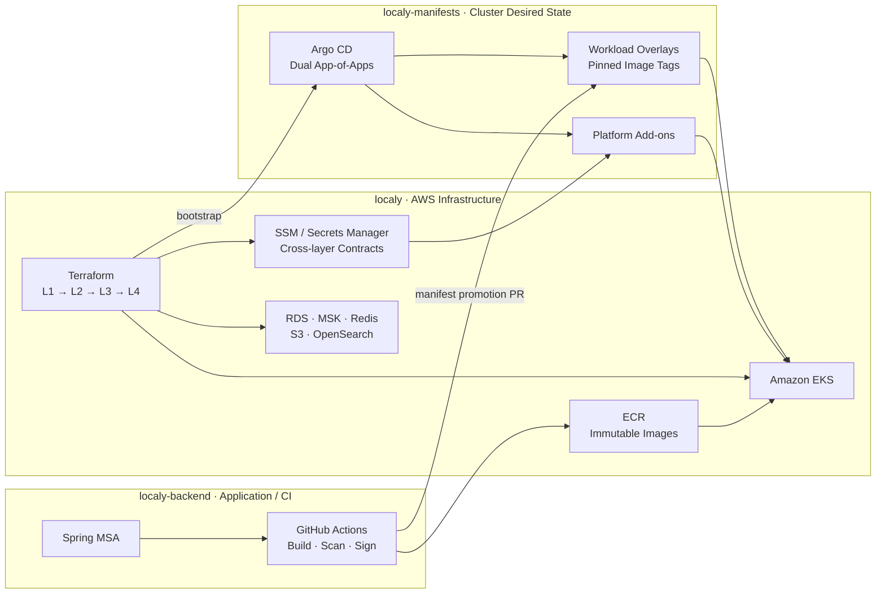

# Localy

AWS EKS에서 커머스 마이크로서비스를 운영하기 위해 구축한 Cloud Native 플랫폼입니다.
Terraform으로 AWS 기반을 계층화하고, Argo CD가 별도 GitOps 저장소의 desired state를 동기화합니다. 애플리케이션 변경은 이미지 빌드·서명·검증·승격을 거쳐 점진적으로 배포됩니다.

이 저장소는 세 저장소 중 **AWS 인프라의 Single Source of Truth**입니다.

## Architecture



### Deployment flow

1. Terraform이 네트워크·EKS·데이터 서비스를 생성하고 필요한 ID를 SSM에 기록합니다.
2. GitHub Actions가 변경된 서비스를 빌드하고 ECR에 불변 `sha-*` 태그로 push합니다.
3. CI가 이미지를 검사·서명한 뒤 GitOps 저장소의 이미지 핀을 변경하는 승격 PR을 만듭니다.
4. Argo CD가 병합된 desired state를 동기화하고 Kyverno가 admission 단계에서 이미지를 검증합니다.
5. `order-service`는 Argo Rollouts와 Prometheus SLI Analysis를 거쳐 canary로 승급됩니다.

Argo CD는 최신 태그를 탐색하지 않습니다. **CI는 이미지를 만들고, Git은 배포할 버전을 선택하며, Argo CD는 Git을 동기화합니다.**

## Repository boundaries

| Repository | Single Source of Truth |
| --- | --- |
| **[localy](https://github.com/hetrkumt/localy)** | Terraform 기반 AWS 인프라와 계층 간 계약 |
| **[localy-manifests](https://github.com/hetrkumt/localy-manifests)** | Kubernetes·Argo CD desired state와 이미지 핀 |
| **[localy-backend](https://github.com/hetrkumt/localy-backend)** | 애플리케이션 소스와 이미지 CI 파이프라인 |

저장소 경계를 통해 Terraform, 애플리케이션 빌드, 클러스터 desired state가 서로의 리소스를 직접 소유하지 않도록 했습니다.

## Infrastructure layers

Terraform state와 장애 범위를 분리하기 위해 프로덕션 인프라를 순차 계층으로 구성합니다.

| Layer | Responsibility |
| --- | --- |
| `bootstrap` | Terraform backend용 S3·DynamoDB·KMS |
| `l1-network` | VPC, subnet, routing과 네트워크 기반 |
| `l2-eks` | EKS, OIDC, 노드·플랫폼 IAM, Karpenter 기반 |
| `l3-app-integration` | RDS, MSK, Redis, ECR, Secrets Manager, S3, OpenSearch |
| `l4-bootstrap` | Argo CD 설치와 root Application 진입점 |

각 계층은 같은 backend bucket을 사용하되 **서로 다른 state key**를 갖습니다. 하위 계층이 필요한 ID는 `terraform_remote_state` 대신 SSM Parameter Store를 통해 전달합니다.

## Design principles

### GitOps as the deployment contract

* Terraform은 AWS 인프라와 Argo CD 진입점까지만 소유합니다.
* 플랫폼 add-on과 워크로드는 `localy-manifests`가 소유합니다.
* 플랫폼과 워크로드는 별도의 App-of-Apps 및 AppProject 경계로 동기화됩니다.
* 동적 필드(`replicas`, ESO가 관리하는 Secret 등)는 `ignoreDifferences`로 해당 컨트롤러에 소유권을 넘깁니다.

### Verified image promotion

* ECR repository는 immutable tag와 scan-on-push를 사용합니다.
* CI는 Trivy 검사와 Cosign keyless 서명을 수행합니다.
* Kyverno는 허용된 ECR과 CI identity로 서명된 이미지만 admission에서 허용합니다.
* 이미지 버전 변경은 클러스터의 수동 `kubectl set image`가 아니라 Git 승격 PR로 기록합니다.

### Workload and node scaling

* Karpenter는 system, observability, workload, batch NodePool을 taint로 격리합니다.
* KEDA가 Pod replica의 런타임 소유자이며 기존 HPA는 retired 상태입니다.
* `order-service`는 MSK consumer lag로 Rollout replica를 조절하고, edge/cart는 Prometheus 지표를 사용합니다.

### Security and observability

* Secrets Manager → External Secrets → Kubernetes Secret으로 시크릿을 전달합니다.
* 플랫폼 컨트롤러와 워크로드는 ServiceAccount별 IRSA/Pod Identity로 AWS 권한을 분리합니다.
* Prometheus recording rule은 Rollout Analysis와 일부 KEDA trigger가 함께 사용합니다.
* 로그는 Fluent Bit → Loki/S3, 트레이스는 OTel Gateway → OpenSearch로 분리합니다.

## Repository layout

```text
localy/
└── infrastructure/
    ├── bootstrap/
    ├── modules/
    │   ├── network/
    │   └── eks/
    ├── environments/
    │   └── prod/
    │       ├── l1-network/
    │       ├── l2-eks/
    │       ├── l3-app-integration/
    │       └── l4-bootstrap/
    └── scripts/

```

## Provisioning order

### Prerequisites

* Terraform
* AWS CLI와 대상 계정 자격 증명
* `kubectl`
* 접근 가능한 GitHub 저장소

### Apply

아래 순서를 지켜 각 디렉터리에서 `terraform init`, `terraform plan`, `terraform apply`를 실행합니다.

```text
infrastructure/bootstrap
  → environments/prod/l1-network
  → environments/prod/l2-eks
  → environments/prod/l3-app-integration
  → environments/prod/l4-bootstrap

```

상위 계층이 실패하면 다음 계층을 진행하지 않습니다. 실제 적용 전 backend 설정·변수·AWS 계정과 리전에 대한 검토가 필요합니다.

> `terraform destroy`는 Object Lock이 적용된 Loki 로그 볼트와 보존 KMS 키 때문에 일반적인 역순 삭제만으로 완료되지 않을 수 있습니다.

## Technology

**Cloud / IaC**

AWS EKS, IAM/IRSA, ECR, RDS, MSK, ElastiCache, S3, OpenSearch, Terraform

**GitOps / Delivery**

Argo CD, Argo Rollouts, GitHub Actions, Cosign, Trivy, Kyverno

**Platform**

Kubernetes, Kustomize, External Secrets, Karpenter, KEDA

**Observability**

Prometheus, Grafana, Loki, Fluent Bit, OpenTelemetry

## Project status

현재 인프라 bring-up 및 CI/CD·GitOps 계약 검증 단계입니다. 구성 파일에는 실제 구축 과정에서 발견한 부트스트랩 순서, IAM 전파, CRD 소유권, Object Lock과 같은 운영 제약이 반영되어 있습니다.
