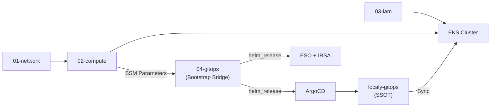

# 🛡️ 04-GitOps (Bootstrap Bridge)

> **이 디렉토리는 EKS 클러스터와 GitOps 파이프라인을 이어주는 1회성 부트스트랩 브릿지입니다.**

Layer `04-gitops`는 Terraform 인프라 스택(`01-network` → `02-compute` → `03-iam`)이 완료된 **이후**, 클러스터에 GitOps 엔진을 **최초 1회** 설치하는 전용 레이어입니다.  
이 레이어가 파괴되면 ArgoCD 컨트롤 플레인과 ESO가 함께 사라지며, **클러스터와 GitOps 간 연결이 영구 단절**됩니다.

---

## 목차

- [목적](#목적)
- [이 레이어가 프로비저닝하는 것](#이-레이어가-프로비저닝하는-것)
- [통제권 이전](#통제권-이전)
- [치명적 주의사항](#-치명적-주의사항)
- [아키텍처 개요](#아키텍처-개요)
- [사전 조건](#사전-조건)
- [최초 1회 배포 (Bootstrap)](#최초-1회-배포-bootstrap)
- [배포 후 확인](#배포-후-확인)
- [State 격리](#state-격리)
- [관련 레포](#관련-레포)

---

## 목적

이 Terraform 레이어의 유일한 목적은 다음 **두 개의 Helm 엔진**을 클러스터에 최초로 띄우는 것입니다.

| 엔진 | Helm Chart | Namespace | 역할 |
|------|------------|-----------|------|
| **ArgoCD** | `argo-cd` | `argocd` | GitOps 컨트롤 플레인 — `localy-gitops` 동기화 엔진 |
| **External Secrets Operator (ESO)** | `external-secrets` | `external-secrets` | AWS Secrets Manager → K8s Secret 브릿지 |

> **이 레이어는 애드온·워크로드 매니페스트를 배포하지 않습니다.**  
> `root-application.yaml` 등 App of Apps 매니페스트는 Terraform이 아닌 **`localy-gitops` 레포**에서 관리합니다.

---

## 이 레이어가 프로비저닝하는 것

| 리소스 유형 | 내용 |
|-------------|------|
| `helm_release` | ArgoCD (ALB Ingress + WAF + OIDC SSO 뼈대) |
| `helm_release` | External Secrets Operator |
| `aws_iam_role` (IRSA) | ESO — Secrets Manager `prod/*` prefix 최소권한 |
| `data.aws_ssm_parameter` | EKS 메타데이터 (02-compute 우체통 소비) |

### 의도적으로 배포하지 않는 것

- ❌ App of Apps / Root Application (`bootstrap/root-application.yaml`)
- ❌ Karpenter, Kyverno, Prometheus, Loki 등 플랫폼 애드온
- ❌ 애플리케이션 워크로드

---

## 통제권 이전

```
[Phase 1] Terraform 04-gitops Apply
    └── ArgoCD + ESO 엔진 기동

[Phase 2] localy-gitops 레포 (GitOps SSOT)
    └── bootstrap/root-application.yaml 수동 등록
    └── addons / observability / workloads 전체 통제권 이전
```

**이 Terraform이 Apply되어 ArgoCD가 정상 기동되면, 이후 모든 애드온 및 워크로드의 통제권은 `localy-gitops` 레포지토리로 완전히 넘어갑니다.**

| 시점 | 통제 주체 | 변경 방법 |
|------|-----------|-----------|
| Bootstrap 직후 | Terraform (`04-gitops`) | ArgoCD/ESO 엔진만 |
| Bootstrap 이후 | GitOps (`localy-gitops`) | PR → ArgoCD Sync |

---

## 🚨 치명적 주의사항

> ### ⛔ 절대 이 경로에서 `terraform destroy`를 실행하지 마십시오.
>
> **전체 GitOps 파이프라인과 컨트롤 플레인 연결이 영구 파괴됩니다.**
>
> - ArgoCD 컨트롤 플레인 삭제 → `localy-gitops` 동기화 중단
> - ESO 삭제 → Secrets Manager 연동 Secret 전체 장애
> - IRSA Role 삭제 → ESO ServiceAccount 권한 상실
>
> 엔진 업그레이드·설정 변경은 `terraform apply`로만 수행하고, **destroy는 금지**합니다.

---

## 아키텍처 개요



### 데이터 흐름 원칙

| 원칙 | 내용 |
|------|------|
| State 격리 | `terraform_remote_state` **금지** — SSM Parameter Store 우체통만 사용 |
| EKS 인증 | `aws eks get-token` exec (15분 동적 갱신) |
| State Key | `eks-gitops/prod/04-gitops.tfstate` (독립 격리) |

---

## 사전 조건

### 레이어 의존성 (필수)

아래 레이어가 **이미 Apply 완료**되어 있어야 합니다.

| 순서 | 레이어 | 확인 항목 |
|------|--------|-----------|
| 1 | `01-network` | VPC, WAF, ACM |
| 2 | `02-compute` | EKS 클러스터 + SSM Parameters 발행 |
| 3 | `03-iam` | ALB Controller, IRSA 기반 애드온 SA |

SSM Parameter 확인 예시:

```bash
aws ssm get-parameter --name /localy/prod/compute/cluster_name --region ap-northeast-2
```

### 도구 (Prerequisites)

| 도구 | 용도 |
|------|------|
| [Terraform](https://www.terraform.io/) ≥ 1.5 | `init` / `plan` / `apply` |
| [AWS CLI](https://aws.amazon.com/cli/) v2 | EKS `get-token` 인증 |
| `kubectl` (선택) | 배포 후 Pod 상태 확인 |

AWS 자격 증명은 EKS 클러스터에 `eks:DescribeCluster` 및 `get-token` 권한이 있는 프로필을 사용하세요.

---

## 최초 1회 배포 (Bootstrap)

> **이 명령어 세트는 클러스터당 최초 1회만 실행합니다.**

```bash
# 1. 04-gitops 디렉토리로 이동
cd localy/infrastructure/environments/prod/04-gitops

# 2. State backend 초기화 (S3: eks-gitops/prod/04-gitops.tfstate)
terraform init

# 3. 변경 사항 검토 (ArgoCD + ESO + IRSA만 생성되는지 확인)
terraform plan

# 4. Bootstrap Apply (최초 1회)
terraform apply
```

### Apply 시 생성되는 리소스 체크리스트

- [ ] `helm_release.argocd` — namespace `argocd`
- [ ] `helm_release.external_secrets` — namespace `external-secrets`
- [ ] `module.irsa_eso` — IAM Role `prod-eso-irsa-role`
- [ ] ArgoCD Ingress — ALB + WAF + ACM 연동

---

## 배포 후 확인

```bash
# ArgoCD / ESO Pod 상태
kubectl get pods -n argocd
kubectl get pods -n external-secrets

# ArgoCD Ingress (ALB) 확인
kubectl get ingress -n argocd

# ESO ServiceAccount IRSA annotation 확인
kubectl get sa external-secrets -n external-secrets -o yaml | grep role-arn
```

### 통제권 이전 (수동 — 필수 후속 작업)

ArgoCD가 정상 기동되면, **Terraform이 아닌 GitOps 레포**에서 Root Application을 등록합니다.

```bash
# localy-gitops 레포의 bootstrap/root-application.yaml을
# ArgoCD UI 또는 CLI로 수동 등록 (Terraform 배포 금지)
```

자세한 GitOps 워크플로는 [`localy-gitops/README.md`](../../../../../../localy-gitops/README.md)를 참조하세요.

---

## State 격리

| 항목 | 값 |
|------|-----|
| S3 Bucket | `feifo-prod-tf-state-backend` |
| State Key | `eks-gitops/prod/04-gitops.tfstate` |
| Region | `ap-northeast-2` |
| Lock | `use_lockfile = true` |

| 레이어 | State Key |
|--------|-----------|
| 01-network | `eks-gitops/prod/01-network.tfstate` |
| 02-compute | `eks-gitops/prod/02-compute.tfstate` |
| 03-iam | `eks-gitops/prod/03-iam.tfstate` |
| **04-gitops** | **`eks-gitops/prod/04-gitops.tfstate`** |

---

## 관련 레포

| 레포 | 역할 |
|------|------|
| `localy/` (이 레포) | Terraform — AWS/EKS 프로비저닝 + Bootstrap Bridge |
| `localy-gitops/` (Sibling) | GitOps SSOT — ArgoCD가 동기화하는 선언형 매니페스트 |

---

## 파일 구성

```
04-gitops/
├── README.md       # 이 문서
├── backend.tf      # S3 state 격리
├── providers.tf    # aws / kubernetes / helm (exec auth)
├── variables.tf    # 레이어 변수
└── main.tf         # SSM data + ArgoCD/ESO helm_release + ESO IRSA
```
